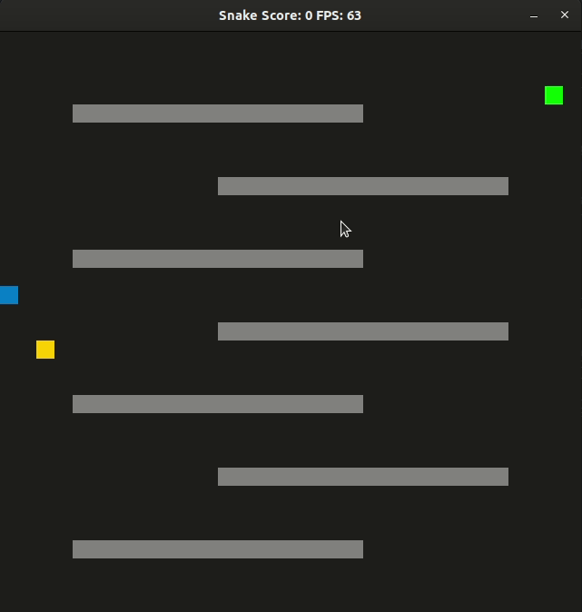

# CPPND: Capstone Snake Game Example

- [CPPND: Capstone Snake Game Example](#cppnd-capstone-snake-game-example)
  - [Dependencies for Running Locally](#dependencies-for-running-locally)
  - [Basic Build Instructions](#basic-build-instructions)
  - [Comment to the Project Rubric](#comment-to-the-project-rubric)
    - [README](#readme)
    - [Compiling and Testing](#compiling-and-testing)
    - [Loops, Functions, I/O](#loops-functions-io)
    - [Object Oriented Programming](#object-oriented-programming)
    - [Memory Management](#memory-management)
    - [Concurrency](#concurrency)
  - [CC Attribution-ShareAlike 4.0 International](#cc-attribution-sharealike-40-international)

This is the implementation of Capstone project in the [Udacity C++ Nanodegree Program](https://www.udacity.com/course/c-plus-plus-nanodegree--nd213). It is created by forking the original template of Udacity. The code for this repo was inspired by [this](https://codereview.stackexchange.com/questions/212296/snake-game-in-c-with-sdl) excellent StackOverflow post and set of responses.

The Capstone Project gives you a chance to integrate what you've learned throughout this program. This project will become an important part of your portfolio to share with current and future colleagues and employers.

As Capstone project, I decided to extend the Snake game, following the principles I have learned throughout this Nanodegree Program.

## Dependencies for Running Locally
* cmake >= 3.7
  * All OSes: [click here for installation instructions](https://cmake.org/install/)
* make >= 4.1 (Linux, Mac), 3.81 (Windows)
  * Linux: make is installed by default on most Linux distros
  * Mac: [install Xcode command line tools to get make](https://developer.apple.com/xcode/features/)
  * Windows: [Click here for installation instructions](http://gnuwin32.sourceforge.net/packages/make.htm)
* SDL2 >= 2.0
  * All installation instructions can be found [here](https://wiki.libsdl.org/Installation)
  > Note that for Linux, an `apt` or `apt-get` installation is preferred to building from source. 
* gcc/g++ >= 5.4
  * Linux: gcc / g++ is installed by default on most Linux distros
  * Mac: same deal as make - [install Xcode command line tools](https://developer.apple.com/xcode/features/)
  * Windows: recommend using [MinGW](http://www.mingw.org/)

## Basic Build Instructions

1. Clone this repo.
2. Make a build directory in the top level directory: `mkdir build && cd build`
3. Compile: `cmake .. && make`
4. Run it: `./SnakeGame`.

## Comment to the Project Rubric

### README

This README contains all the information required by the rubric:

:white_check_mark: A README with instructions is included with the project.

:white_check_mark: The README indicates which project is chosen.

:white_check_mark: The README includes information about each rubric point addressed.
### Compiling and Testing

This can be tested by using the instructions [here](#basic-build-instructions).

:white_check_mark: The submission must compile and run.

### Loops, Functions, I/O

:white_check_mark: The project demonstrates an understanding of C++ functions and control structures

It is possible to see modification and additional implementations that proves this in the code.

:white_check_mark: The project reads data from a file and process the data, or the program writes data to a file.

This part is implemented to gather the map from a txt file. The code used can be found [here](https://github.com/PieroMacaluso/CppND-Capstone-Snake-Game/blob/master/src/game.cpp#L86-L101)

:white_check_mark: The project accepts user input and processes the input.

The code gets the input of the user to make the snake do actions, but also to close/restart the game. In addition, at the start of the game we can put the name of the map we want to use as argument (e.g., `./SnakeGame map_2.txt`).

### Object Oriented Programming

:white_check_mark: The project uses Object Oriented Programming techniques.

:white_check_mark: Classes use appropriate access specifiers for class members.

:white_check_mark: Class constructors utilize member initialization lists.

:white_check_mark: Classes abstract implementation details from their interfaces.

:white_check_mark: Classes encapsulate behavior.

:white_check_mark: Classes follow an appropriate inheritance hierarchy.

:negative_squared_cross_mark: Overloaded functions allow the same function to operate on different parameters.

:white_check_mark: Derived class functions override virtual base class functions.

And example [here](https://github.com/PieroMacaluso/CppND-Capstone-Snake-Game/blob/master/src/power.h)

:negative_squared_cross_mark: Templates generalize functions in the project.

### Memory Management

:white_check_mark: The project makes use of references in function declarations.

We have two functions that use pass-by-reference in the project code [here](https://github.com/PieroMacaluso/CppND-Capstone-Snake-Game/blob/master/src/power.cpp).

:negative_squared_cross_mark: The project uses destructors appropriately.

:negative_squared_cross_mark: The project uses scope / Resource Acquisition Is Initialization (RAII) where appropriate.

Not necessary for the project itself.

:negative_squared_cross_mark: The project follows the Rule of 5.

Not necessary for the project itself.

:negative_squared_cross_mark: The project uses move semantics to move data, instead of copying it, where possible.

Not necessary for the project itself

:white_check_mark: The project uses smart pointers instead of raw pointers.

I used a `shared_ptr` for the powerups [here](https://github.com/PieroMacaluso/CppND-Capstone-Snake-Game/blob/master/src/game.h).

### Concurrency

The implementation of the points in this part can be seen here[here](https://github.com/PieroMacaluso/CppND-Capstone-Snake-Game/blob/master/src/game.cpp)

:white_check_mark: The project uses multithreading.

:negative_squared_cross_mark: A promise and future is used in the project.

:white_check_mark: A mutex or lock is used in the project.

:white_check_mark: A condition variable is used in the project.

## CC Attribution-ShareAlike 4.0 International

Shield: [![CC BY-SA 4.0][cc-by-sa-shield]][cc-by-sa]

This work is licensed under a
[Creative Commons Attribution-ShareAlike 4.0 International License][cc-by-sa].

[![CC BY-SA 4.0][cc-by-sa-image]][cc-by-sa]

[cc-by-sa]: http://creativecommons.org/licenses/by-sa/4.0/
[cc-by-sa-image]: https://licensebuttons.net/l/by-sa/4.0/88x31.png
[cc-by-sa-shield]: https://img.shields.io/badge/License-CC%20BY--SA%204.0-lightgrey.svg